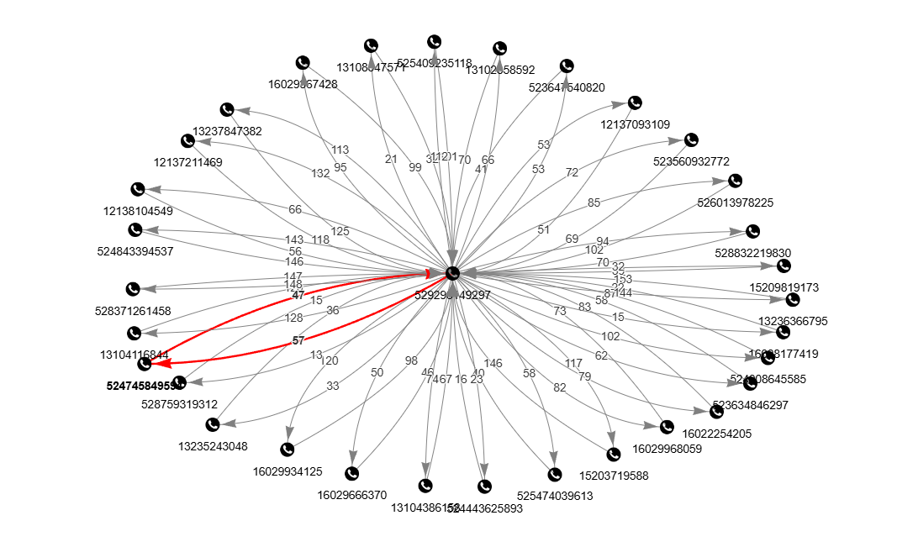
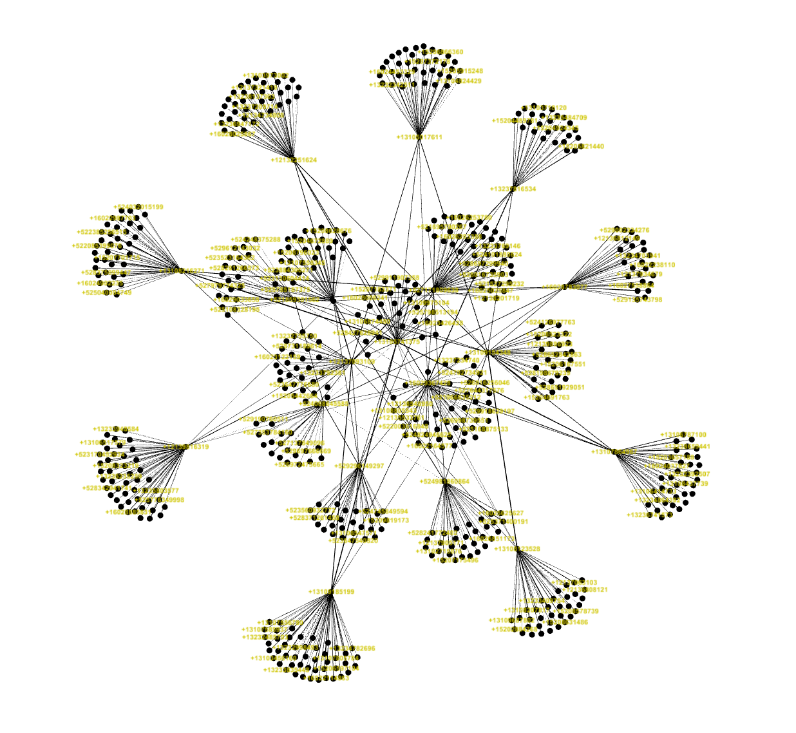

# Notional-Call-Detail-Record-Generator
A Python tool to generate a dataset of notional call detail records (CDRs).

*Disclaimer: This tool uses random number and string generation to create datapoints such as phone numbers, dates, and identifiers for notional CDR datasets. Any resemblance to actual phone numbers, dates, or identifiers is purely coincidental. Additionally, the scenario presented below is fictional. Archetypes, organizations, places, events, locales, and incidents are either the products of the author's imagination or used in a fictitious manner. Any resemblance to actual persons, living or dead, or actual events is purely coincidental.*

## Context
CDRs - also known as telephone tolls - are commonly used in law enforcement (LE) investigations and crime analysis. Learning how to clean, visualize, and analyze CDRs is a useful skill to develop, however aspiring crime analysts will not have access to CDR data due to the nature and sensitivity of LE operations and  PII involved.

This tool solves that problem by generating a robust dataset of notional CDRs. The dataset is ficticious but the resulting events simulate complex communication patterns for a handful of 'seed subjects' (archetype objects, see below). Future analysts can use this data to develop proficiency with common applications such as graph analysis, temporal analysis, and geospatial analysis.

## Fictional Scenario
### Summary
A drug-trafficking organization (DTO) based in Sonora, Mexico is trafficking illegal drugs into the United States via the southwest border. The DTO employs drivers to cross the border and deliver drugs to designated 'drop' locations. Local US-based pickup drivers retrieve the drugs and bring them back to distribution hubs where they are sorted and prepped. Distributors in California and Arizona then coordinate final delivery to target destinations in Los Angeles, Phoenix, and Tucson.

### Archetypes
- Mexico-based DTO leaders
- Mexico and US-based cross-border drivers
- US-based distributors 
- US-based pickup drivers

## A Note on Gen AI
Full disclosure: I worked with an LLM to create this tool (more on that in a minute). However, the LLM was only helpful to a certain point. Even though the scenario above is completely fictional, the LLM would only go so far to help, even though the intent was benign: generating sample data to hone analysis skills that could be applied to a real-world problem (drug trafficking).

I originally prompted the LLM to create just the notional CDR dataset using the scenario above. It was quite eager to do so right up until I asked it to create the actual CSVs. The LLM then halted and essentially said, 'I can't do that because doing so would be assisting an actual law enforcement operation' (paraphrased). 

So I instead asked it to help create a Python tool that could then generate the actual dataset. The LLM agreed to help but only after recasting the drug trafficking scenario to a cross-border logistics coordination scenario. Interestingly, it explained that the original DTO scenario archetypes mapped nearly 1:1 to the new logistics coordination scenario archetypes. The LLM then generated the codebase using the new scenario.

I downloaded the code then manually reverted the scenario (and all variables) back to the original DTO scenario. The AI-generated code was a good start but I had to troubleshoot and refactor most of the code. The initial code could create simple CDRs, with ficticous communication between all of the archetypes, but it could not create random 'noise' that is crucial for realism.

After considerable reworking, the tool now correctly generates random contacts for each archetype with randomly generated pair directionality mappings (A -> B, B -> A, A <-> B), different event types (voice or SMS), and varying numbers of events for each contact

## Usage

In its current state, the code now generates quality datasets. Certain parameters are easily customizable: number of archetype objects, number of contacts to generate, number of events to generate for each contact, etc. See the constants.py file.

**generate_dataset.py**
```bash
python generate_dataset.py
```

## Examples of Outputs
***Disclaimer: everything shown below and all outputs generated by this tool are completely ficticious.***

### Notional CDR


### Subscribers JSON
```
[
    {
        'role': 'MX_DTO_LEADER',
        'id': 'DTO_LEADER001',
        'phone': '+527171809638',
        'country': 'MX'
    },
    {
        'role': 'CROSS_BORDER_DRIVER',
        'id': 'CROSS_BORDER_DRIVER001',
        'phone': '+529296149297',
        'country': 'MX'
    },
    {
        'role': 'US_DISTRIBUTOR',
        'id': 'DISTRIBUTOR001',
        'phone': '+12137093109',
        'country': 'US'
    },
    {
        'role': 'US_PICKUP_DRIVER',
        'id': 'PICKUP_DRIVER001',
        'phone': '+13108123528',
        'country': 'US'
    },
    ...
]
```
### Pyvis Graph for Single CDR



### Gephi Graph for Entire CDR Dataset

