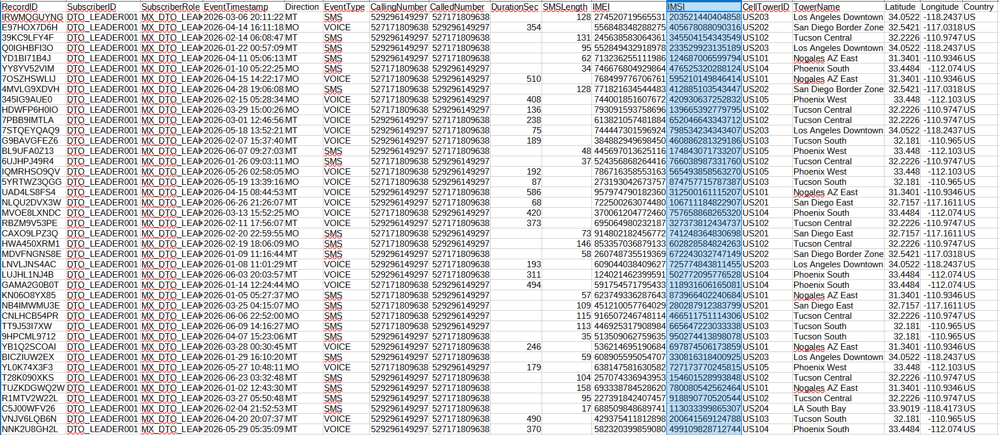

# Notional-Call-Detail-Record-Generator
A Python tool to generate a dataset of notional call detail records (CDRs) for a simulated law enforcement investigation / crime intelligence analysis.

**Example CDR output**

***[This is completely ficticious data]***

**Example graph visualization from aggregated CDRs**

***[This is completely ficticious data]***